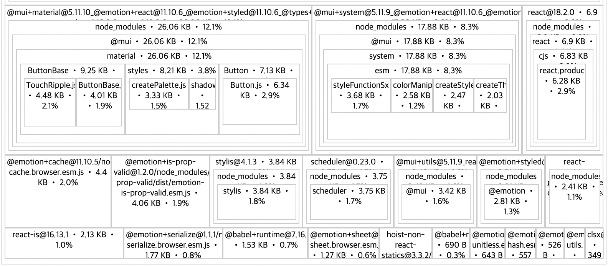

pnpm 상에서 두 패키지의 `dependencies`에  `@mui/material`을 추가할 경우 번들링 확인

`webpack-bundle-analyzer`를 사용

```
$ pnpm analyze
```

> https://stackoverflow.com/questions/58112616/how-to-build-bundle-stats-json-in-create-react-app

번들링 결과를 `source-map-explorer`로 확인

두벌 들어가 있음


> [Exact same dependencies across different packages are all bundled instead of just 1? · Discussion #6055 · pnpm/pnpm](https://github.com/pnpm/pnpm/discussions/6055)

동일한 버전의 `peerDependencies`를 설치해 주어야 함.

즉, 
```
      "@emotion/react": "^11.10.6",
      "@emotion/styled": "^11.10.6",
```

최상위 `package.json`에 다음과 같이 `override` 설정필요

```
  "pnpm": {
    "overrides": {
      "@emotion/react": "^11.10.6",
      "@emotion/styled": "^11.10.6",
      "@mui/material": "^5.10.16",
      "@types/react": "^18.0.26",
      "react": "^18.2.0",
      "react-dom": "^18.2.0"
    }
  }
```

`source-map-explorer` 결과

