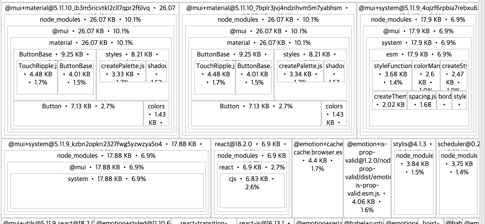

pnpm 상에서 두 패키지의 `dependencies`에  `@mui/material`을 추가할 경우 번들링 확인

`webpack-bundle-analyzer`를 사용

```
$ pnpm analyze
```

> https://stackoverflow.com/questions/58112616/how-to-build-bundle-stats-json-in-create-react-app

번들링 결과를 `source-map-explorer`로 확인

두벌 들어가 있음

